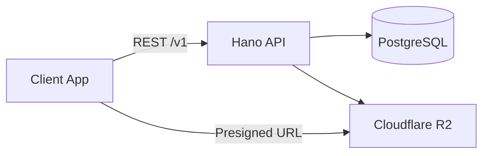
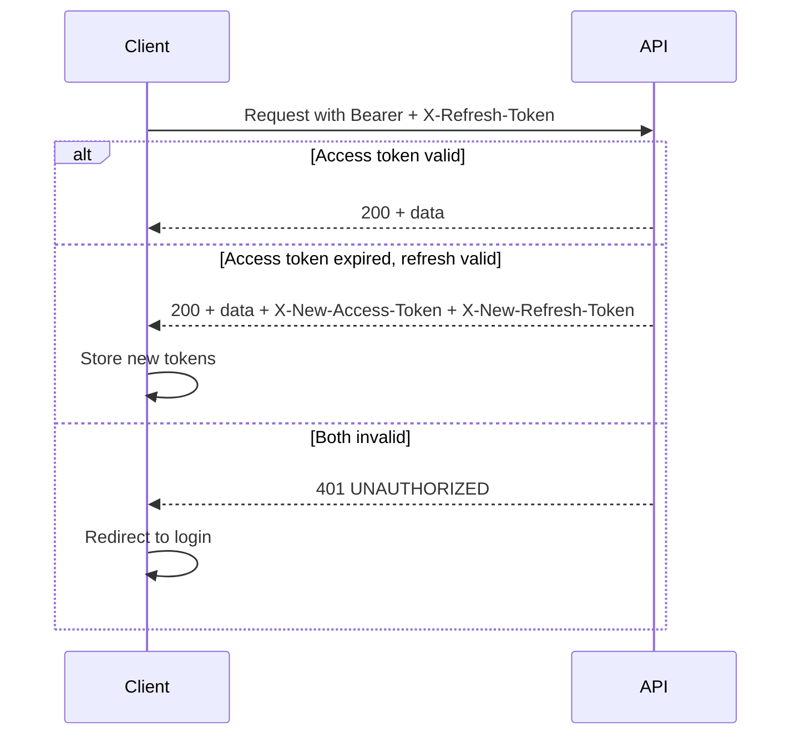
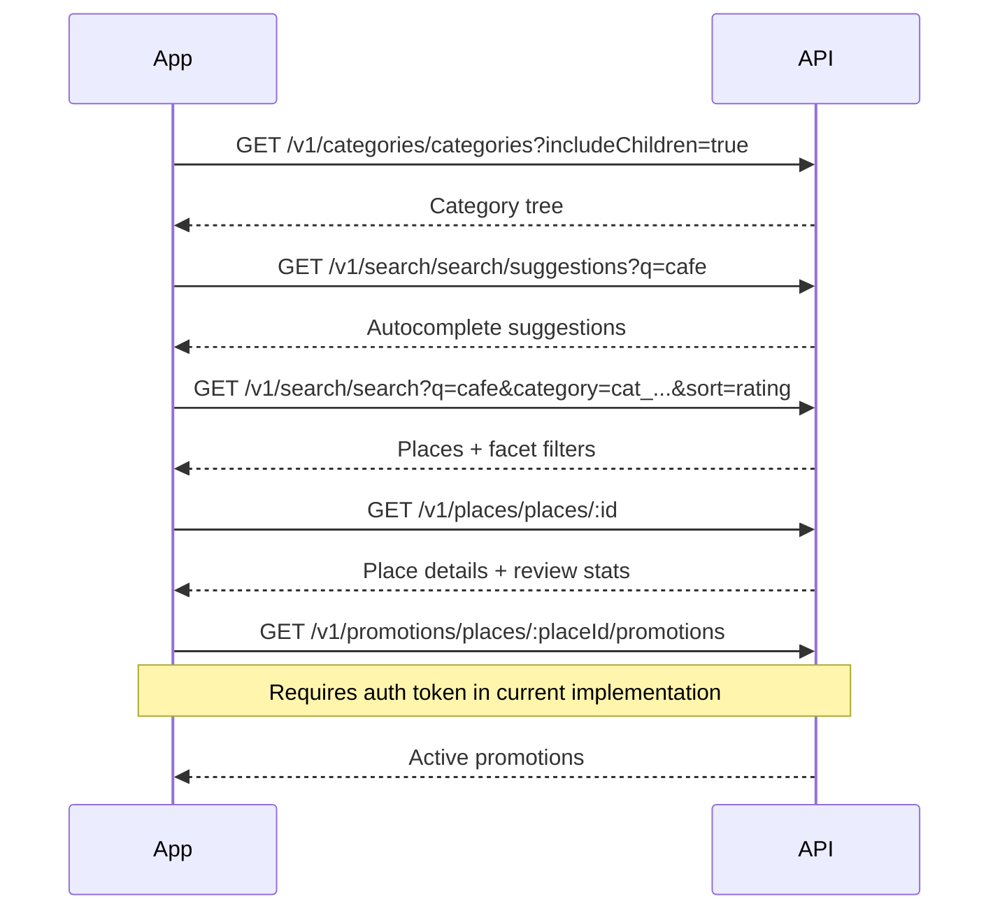
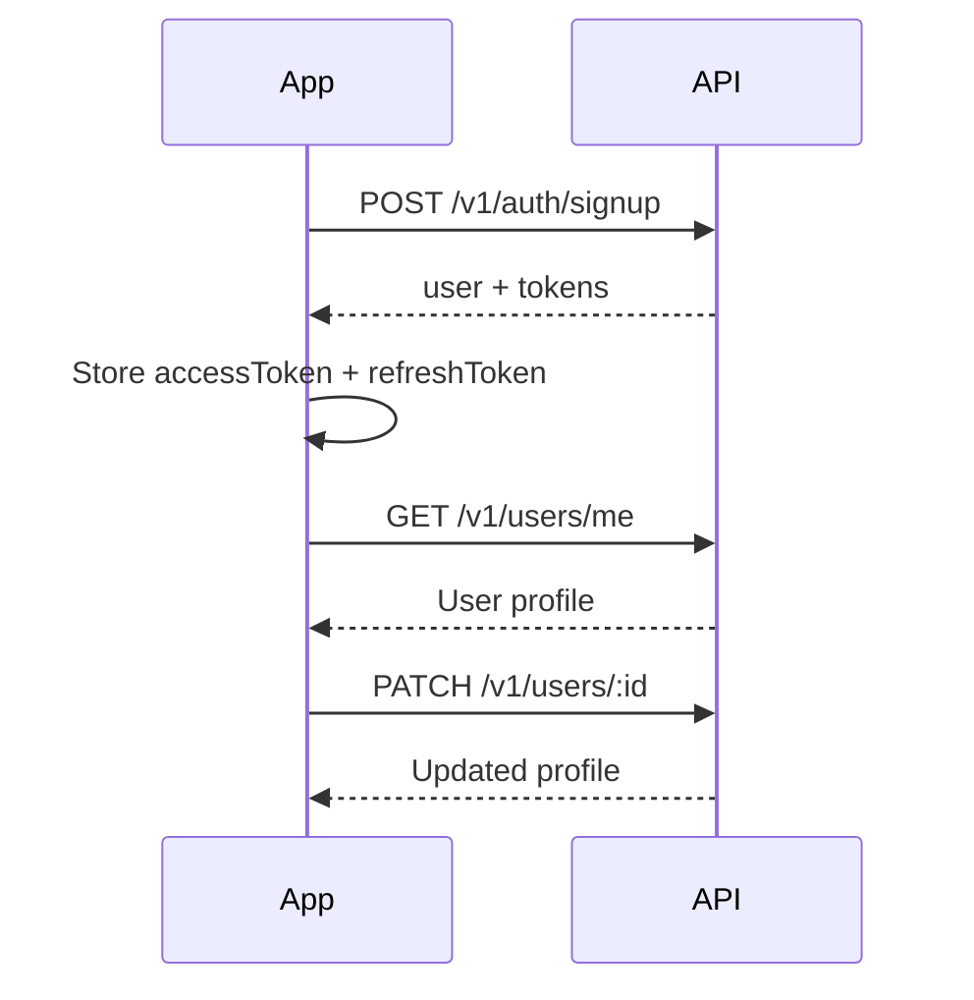
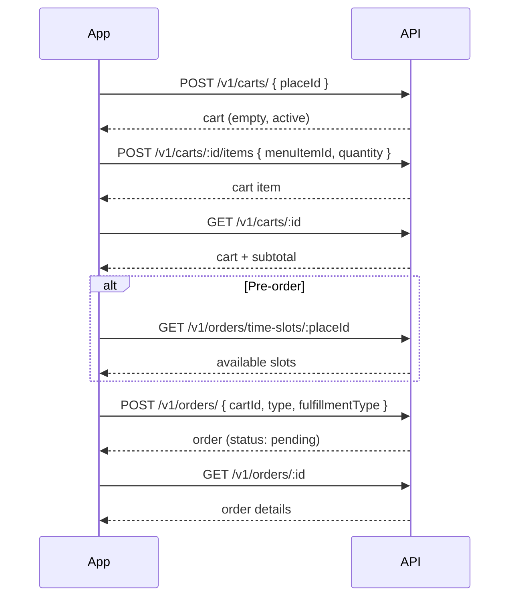
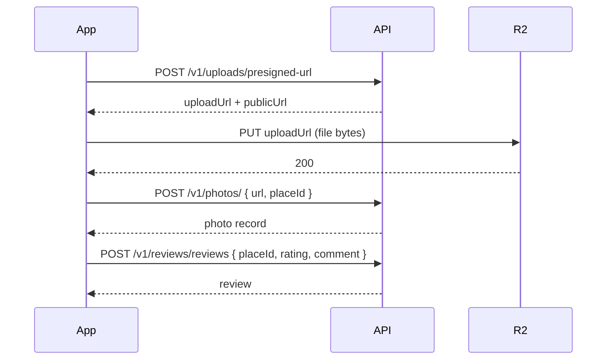
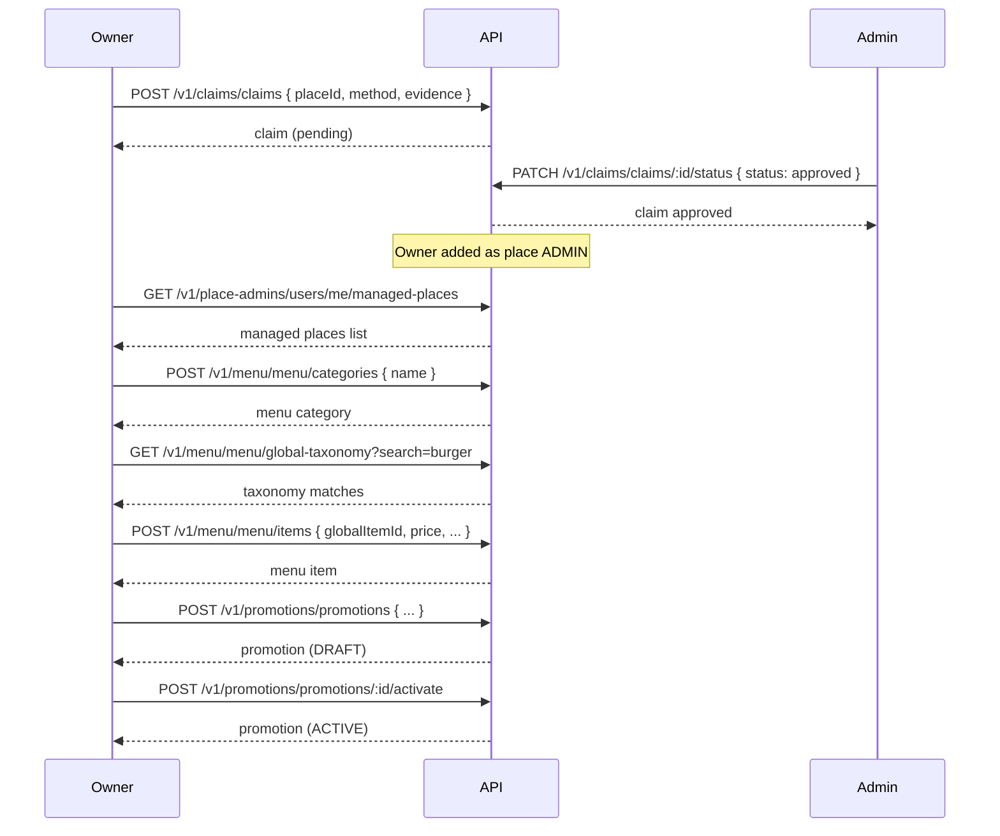
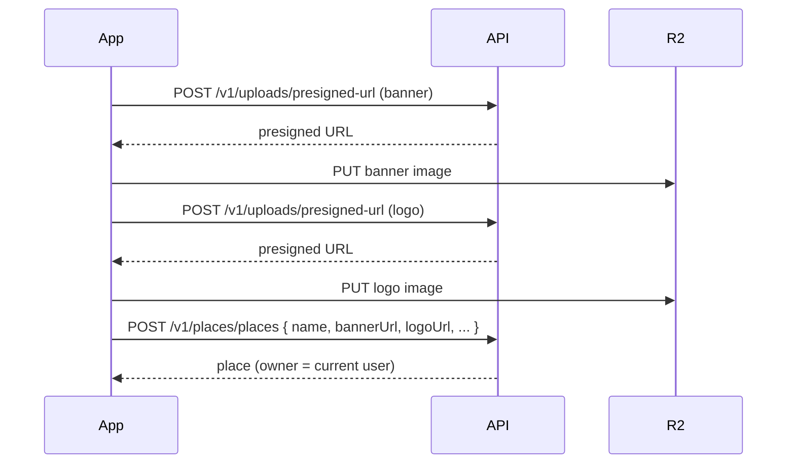

# Hano API — Integration Guide

Complete reference for integrating with the Hano.places REST API: authentication, every endpoint, request/response shapes, and end-to-end flows from discovery through ordering and business management.

---

## Table of Contents

1. [Overview](#overview)
2. [Getting Started](#getting-started)
3. [Authentication](#authentication)
4. [Request & Response Conventions](#request--response-conventions)
5. [Error Handling](#error-handling)
6. [Rate Limiting & CORS](#rate-limiting--cors)
7. [Endpoint Reference](#endpoint-reference)
8. [Integration Flows](#integration-flows)
9. [Appendix](#appendix)

---

## Overview

Hano API is a TypeScript REST API built on [Hono](https://hono.dev) with OpenAPI 3.1 documentation. It powers the Hano.places platform: discovering venues, browsing menus, placing orders, leaving reviews, and managing business listings.

| Resource | Description |
|----------|-------------|
| **Base URL (production)** | `https://hanoplaces.fly.dev` |
| **Base URL (local dev)** | `http://localhost:4000` |
| **API prefix** | `/v1` |
| **OpenAPI spec** | `GET /openapi` |
| **Interactive docs** | `GET /` (Scalar UI) |
| **Health check** | `GET /health` → `{ "status": "ok" }` |
| **Content type** | `application/json` (except file uploads) |
| **API version** | `0.0.1` |

### Architecture at a Glance



### Route Access Tiers

Routes fall into three tiers based on middleware applied in `src/rest/routers/index.ts`:

| Tier | Middleware | Routes |
|------|------------|--------|
| **Public** | Database only | Auth (signup/login/refresh), Places (read), Categories (read), Search |
| **Authenticated** | Database + JWT auth | Carts, Orders, Reviews, Claims, Photos, Menu, Promotions, Users, Place Admins, Roles, Uploads |
| **Permission-gated** | Auth + specific permission | Category CRUD, Role management, Promotion management, Claim approval, etc. |

> **Note on path prefixes:** Routers are mounted at a prefix (e.g. `/v1/places`) and define their own paths inside (e.g. `/places`). The **full URL** is the concatenation of both. For example: mount `/v1/places` + route `/places` → **`GET /v1/places/places`**.

---

## Getting Started

### 1. Configure your client origin

The API uses CORS with credentials. Your frontend origin must be listed in the server's `ALLOWED_CLIENT_ORIGINS` environment variable (comma-separated).

Default local value: `http://localhost:3000`

### 2. Verify connectivity

```http
GET /health
```

Expected response (`200`):

```json
{ "status": "ok" }
```

### 3. Explore the OpenAPI spec

```http
GET /openapi
```

Or open `https://hanoplaces.fly.dev/` in a browser for the Scalar documentation UI.

### 4. Authenticate (see [Authentication](#authentication))

Most write operations and all user-specific reads require a JWT access token.

### 5. Build your first flow

A typical consumer journey:

1. Browse categories → search places → view place details (no auth)
2. Sign up / log in
3. Browse menu, add items to cart, place order (auth required)
4. Leave a review, upload photos (auth required)

---

## Authentication

### Token Model

| Token | Lifetime | Usage |
|-------|----------|-------|
| **Access token** | 15 minutes | Sent on every authenticated request |
| **Refresh token** | 30 days | Used to obtain new access tokens |

Tokens are HS256 JWTs signed with server secrets (`ACCESS_TOKEN_SECRET`, `REFRESH_TOKEN_SECRET`).

### Required Headers (authenticated requests)

```http
Authorization: Bearer <accessToken>
X-Refresh-Token: <refreshToken>    # optional but recommended
Content-Type: application/json
```

When the access token is expired but the refresh token is valid, the server automatically refreshes tokens and returns new ones in response headers:

```http
X-New-Access-Token: <newAccessToken>
X-New-Refresh-Token: <newRefreshToken>
```

Your client should watch for these headers and persist the new tokens.

### Auth Endpoints

All auth routes are mounted at `/v1/auth`. Auth endpoints have a stricter rate limit: **5 requests per 15 minutes** per IP.

---

#### `POST /v1/auth/signup`

Create a new account with email and password.

**Auth required:** No

**Request body:**

```json
{
  "name": "Jane Doe",
  "email": "jane@example.com",
  "password": "SecurePass123"
}
```

| Field | Type | Rules |
|-------|------|-------|
| `name` | string | min 2 characters |
| `email` | string | valid email |
| `password` | string | min 8 characters |

**Response `201`:**

```json
{
  "user": {
    "id": "usr_...",
    "name": "Jane Doe",
    "email": "jane@example.com",
    "emailVerified": false,
    "image": null,
    "onboardingCompleted": null,
    "createdAt": "2026-06-16T10:00:00.000Z",
    "updatedAt": "2026-06-16T10:00:00.000Z"
  },
  "accessToken": "eyJ...",
  "refreshToken": "eyJ..."
}
```

**Errors:** `409 CONFLICT` if email already registered.

---

#### `POST /v1/auth/login`

Log in with email and password.

**Auth required:** No

**Request body:**

```json
{
  "email": "jane@example.com",
  "password": "SecurePass123"
}
```

**Response `200`:** Same shape as signup (`user`, `accessToken`, `refreshToken`).

**Errors:**
- `401 UNAUTHORIZED` — invalid credentials
- `401 UNAUTHORIZED` — "Please login with your social account" (OAuth-only account)

---

#### `POST /v1/auth/refresh`

Obtain new tokens using a refresh token.

**Auth required:** No

**Request body:**

```json
{
  "refreshToken": "eyJ..."
}
```

**Response `200`:**

```json
{
  "accessToken": "eyJ...",
  "refreshToken": "eyJ..."
}
```

**Errors:** `401 UNAUTHORIZED` if refresh token is invalid or revoked.

---

#### `POST /v1/auth/logout-devices`

Invalidate all refresh tokens for the current user (logout everywhere).

**Auth required:** Yes

**Response `200`:**

```json
{ "message": "Logged out successfully" }
```

---

#### `GET /v1/auth/oauth/google`

Google OAuth login/signup. Initiated as a browser redirect flow via `@hono/oauth-providers/google`.

**Auth required:** No (browser session)

**Response `200`:** `{ user, accessToken, refreshToken }`

**Errors:** `400` if Google auth fails or email is missing.

---

#### `GET /v1/auth/oauth/instagram/authorize`

Redirects the browser to Instagram's OAuth authorization page.

**Auth required:** No

**Response:** `302` redirect to Instagram.

---

#### `POST /v1/auth/oauth/instagram`

Exchange an Instagram authorization code for tokens.

**Auth required:** No

**Request body:**

```json
{
  "code": "<authorization_code_from_instagram>"
}
```

**Response `200`:** `{ user, accessToken, refreshToken }`

**Instagram flow:**

1. Redirect user to `GET /v1/auth/oauth/instagram/authorize`
2. Instagram redirects back to your `INSTAGRAM_REDIRECT_URI` with a `code`
3. POST the `code` to this endpoint

---

### Token Refresh Strategy (recommended client implementation)



---

## Request & Response Conventions

### IDs

All resource IDs are KSUID-based strings (e.g. `place_2abc...`, `usr_2def...`).

### Dates

- Request bodies: ISO 8601 datetime strings (e.g. `"2026-06-16T14:30:00.000Z"`)
- Response bodies: ISO 8601 strings (dates are normalized server-side)

### Pagination

Two pagination styles are used across the API:

| Style | Parameters | Used by |
|-------|------------|---------|
| **Offset** | `limit` (default 20), `offset` (default 0) | Places, Search, Reviews, Photos, Promotions, Claims |
| **Page** | `page` (default 1), `limit` (default 20) | Orders, Menu items |

Paginated responses typically include `total` and `hasMore` boolean fields.

### Response Envelope

Most endpoints return the resource directly. Some admin endpoints wrap data:

```json
{
  "success": true,
  "data": { ... }
}
```

Error responses always use the standardized envelope (see [Error Handling](#error-handling)).

### Prices

Menu item prices and order amounts are stored as **integers** (smallest currency unit, e.g. cents/RWF).

---

## Error Handling

All API errors return a consistent JSON structure:

```json
{
  "success": false,
  "error": {
    "code": "NOT_FOUND",
    "message": "Place with id 'xyz' not found",
    "details": { "resource": "Place", "id": "xyz" }
  },
  "timestamp": "2026-06-16T10:00:00.000Z"
}
```

`details` is omitted in production.

### Error Codes

| Code | HTTP Status | Meaning |
|------|-------------|---------|
| `INTERNAL_ERROR` | 500 | Unexpected server error |
| `VALIDATION_ERROR` | 400 | Request body/query failed Zod validation |
| `NOT_FOUND` | 404 | Resource does not exist |
| `UNAUTHORIZED` | 401 | Missing or invalid auth token |
| `FORBIDDEN` | 403 | Authenticated but lacking permission |
| `CONFLICT` | 409 | Duplicate resource (e.g. email taken) |
| `INVALID_INPUT` | 400 | Business rule violation |
| `FILE_TOO_LARGE` | 400 | Upload exceeds size limit |
| `INVALID_FILE_TYPE` | 400 | Disallowed MIME type |
| `RATE_LIMITED` | 429 | Too many requests |

---

## Rate Limiting & CORS

### Rate Limits

| Scope | Limit | Window |
|-------|-------|--------|
| General API | 100 requests | 15 minutes |
| Auth endpoints | 5 requests | 15 minutes |
| Upload endpoints | 10 requests | 1 hour |

Rate limit headers follow the `draft-6` standard. On `429`, check the `Retry-After` header.

### CORS

| Setting | Value |
|---------|-------|
| `credentials` | `true` |
| Allowed methods | GET, POST, PUT, PATCH, DELETE, OPTIONS |
| Allowed headers | `Authorization`, `Content-Type`, `accept-language`, `x-trpc-source`, `x-user-locale`, `x-user-timezone`, `x-user-country`, `X-Retry-After` |
| Max age | 86400 seconds |

---

## Endpoint Reference

### System

| Method | Path | Auth | Description |
|--------|------|------|-------------|
| GET | `/health` | No | Health check |
| GET | `/openapi` | No | OpenAPI 3.1 spec |
| GET | `/` | No | Scalar API documentation UI |

---

### Places

Mount: `/v1/places`

| Method | Path | Auth | Permission | Description |
|--------|------|------|------------|-------------|
| GET | `/v1/places/places` | No* | — | List/search places |
| GET | `/v1/places/places/:id` | No* | — | Get place details with review stats |
| POST | `/v1/places/places` | Yes | `PLACE_CREATE` | Create a new place |
| PATCH | `/v1/places/places/:id` | Yes | `PLACE_UPDATE` or place owner/admin | Update a place |

\*Registered before the auth middleware; read endpoints work without a token. Write endpoints require `Authorization` header and will return `403` without valid permissions.

#### `GET /v1/places/places` — Query parameters

| Param | Type | Default | Description |
|-------|------|---------|-------------|
| `q` | string | — | Text search |
| `category` | string | — | Filter by category ID |
| `verified` | boolean | — | Filter verified places |
| `limit` | number | 20 | Max 50 |
| `offset` | number | 0 | Pagination offset |
| `sort` | enum | `name` | `name`, `created`, `rating` |
| `order` | enum | `asc` | `asc`, `desc` |

**Response `200`:**

```json
{
  "data": [
    {
      "id": "place_...",
      "name": "Cafe Example",
      "description": "...",
      "bannerUrl": "https://...",
      "logoUrl": "https://...",
      "websiteUrl": null,
      "verified": false,
      "categoryId": "cat_...",
      "createdAt": "...",
      "updatedAt": "..."
    }
  ],
  "total": 1,
  "hasMore": false
}
```

#### `GET /v1/places/places/:id` — Response

Extends place object with:

```json
{
  "category": { "id": "cat_...", "name": "Restaurants" },
  "reviewStats": {
    "averageRating": 4.5,
    "totalReviews": 12
  }
}
```

#### `POST /v1/places/places` — Request body

```json
{
  "name": "My Restaurant",
  "description": "A great place to eat with at least 10 characters.",
  "bannerUrl": "https://cdn.example.com/banner.jpg",
  "logoUrl": "https://cdn.example.com/logo.jpg",
  "websiteUrl": "https://myrestaurant.com",
  "categoryId": "cat_..."
}
```

| Field | Required | Rules |
|-------|----------|-------|
| `name` | Yes | 1–100 chars |
| `description` | Yes | 10–500 chars |
| `bannerUrl` | Yes | valid URL |
| `logoUrl` | Yes | valid URL |
| `websiteUrl` | No | valid URL |
| `categoryId` | No | category ID |

The authenticated user becomes the place owner.

---

### Categories (Place Taxonomy)

Mount: `/v1/categories`

| Method | Path | Auth | Permission | Description |
|--------|------|------|------------|-------------|
| GET | `/v1/categories/categories` | No | — | List all categories |
| GET | `/v1/categories/categories/:id` | No | — | Get category by ID |
| POST | `/v1/categories/categories` | Yes | `CATEGORY_CREATE` | Create category (admin) |
| PATCH | `/v1/categories/categories/:id` | Yes | `CATEGORY_UPDATE` | Update category (admin) |
| DELETE | `/v1/categories/categories/:id` | Yes | `CATEGORY_DELETE` | Delete category (admin) |

#### `GET /v1/categories/categories` — Query parameters

| Param | Type | Default | Description |
|-------|------|---------|-------------|
| `includeChildren` | boolean | false | Include subcategories |
| `includePlaceCount` | boolean | false | Include place count per category |
| `parentId` | string | — | Filter by parent category |

#### `POST /v1/categories/categories` — Request body

```json
{
  "name": "Restaurants",
  "parentId": "cat_parent_..."
}
```

Delete fails with `400` if the category has places or subcategories.

---

### Search

Mount: `/v1/search`

| Method | Path | Auth | Description |
|--------|------|------|-------------|
| GET | `/v1/search/search` | No | Advanced place search with facets |
| GET | `/v1/search/search/suggestions` | No | Autocomplete suggestions |

#### `GET /v1/search/search` — Query parameters

| Param | Type | Default | Description |
|-------|------|---------|-------------|
| `q` | string | — | Search query |
| `category` | string | — | Category ID filter |
| `verified` | boolean | — | Verified only |
| `hasPromotions` | boolean | — | Places with active promotions |
| `minRating` | number | — | 1–5 |
| `location` | string | — | Reserved for future geo search |
| `limit` | number | 20 | Max 50 |
| `offset` | number | 0 | |
| `sort` | enum | `relevance` | `relevance`, `name`, `rating`, `newest` |

**Response `200`:**

```json
{
  "places": [
    {
      "id": "place_...",
      "name": "...",
      "description": "...",
      "logoUrl": "...",
      "verified": true,
      "category": { "id": "...", "name": "..." },
      "reviewStats": { "averageRating": 4.2, "totalReviews": 8 },
      "activePromotions": 2
    }
  ],
  "total": 1,
  "hasMore": false,
  "filters": {
    "categories": [{ "id": "...", "name": "...", "count": 5 }],
    "hasPromotions": 3,
    "verified": 10
  }
}
```

#### `GET /v1/search/search/suggestions` — Query parameters

| Param | Type | Default | Description |
|-------|------|---------|-------------|
| `q` | string | required | min 1 char |
| `limit` | number | 5 | max 10 |

**Response:**

```json
{
  "suggestions": [
    { "type": "place", "id": "...", "name": "Cafe X", "description": "..." },
    { "type": "category", "id": "...", "name": "Restaurants" }
  ]
}
```

---

### Users

Mount: `/v1/users` (authenticated)

| Method | Path | Auth | Description |
|--------|------|------|-------------|
| GET | `/v1/users/me` | Yes | Get current user profile |
| PATCH | `/v1/users/:id` | Yes | Update profile (self or `USER_UPDATE` permission) |

#### `PATCH /v1/users/:id` — Request body

```json
{
  "name": "Updated Name",
  "image": "https://cdn.example.com/avatar.jpg",
  "onboardingCompleted": true
}
```

All fields are optional.

---

### Reviews

Mount: `/v1/reviews` (authenticated)

| Method | Path | Auth | Description |
|--------|------|------|-------------|
| GET | `/v1/reviews/places/:placeId/reviews` | Yes | List reviews for a place |
| POST | `/v1/reviews/reviews` | Yes | Create a review |
| PATCH | `/v1/reviews/reviews/:id` | Yes | Update review (owner or `REVIEW_MANAGE`) |
| DELETE | `/v1/reviews/reviews/:id` | Yes | Delete review (owner or `REVIEW_MANAGE`) |
| GET | `/v1/reviews/users/me/reviews` | Yes | List current user's reviews |

#### `POST /v1/reviews/reviews` — Request body

```json
{
  "placeId": "place_...",
  "rating": 5,
  "comment": "Excellent food and service!"
}
```

| Field | Required | Rules |
|-------|----------|-------|
| `placeId` | Yes | valid place ID |
| `rating` | Yes | 1–5 |
| `comment` | No | 1–1000 chars |

---

### Photos

Mount: `/v1/photos` (authenticated)

| Method | Path | Auth | Description |
|--------|------|------|-------------|
| GET | `/v1/photos/places/:placeId/photos` | Yes | List photos for a place |
| POST | `/v1/photos/` | Yes | Register an uploaded photo |
| DELETE | `/v1/photos/:id` | Yes | Delete photo (owner or `PHOTO_MANAGE`) |
| GET | `/v1/photos/users/me/photos` | Yes | List current user's photos |

Photos are stored in Cloudflare R2. Upload the file first (see [Uploads](#uploads)), then register it here.

#### `POST /v1/photos/` — Request body

```json
{
  "url": "https://cdn.example.com/photos/abc.jpg",
  "r2Key": "photos/abc.jpg",
  "placeId": "place_...",
  "metadata": {
    "width": 1920,
    "height": 1080,
    "size": 245000,
    "mimeType": "image/jpeg"
  }
}
```

#### `GET /v1/photos/places/:placeId/photos` — Query parameters

| Param | Type | Default |
|-------|------|---------|
| `limit` | number | 20 (max 50) |
| `offset` | number | 0 |

---

### Uploads

Mount: `/v1/uploads` (authenticated, stricter rate limit: 10/hour)

| Method | Path | Auth | Description |
|--------|------|------|-------------|
| POST | `/v1/uploads/presigned-url` | Yes | Get presigned URL for direct R2 upload |
| POST | `/v1/uploads/direct` | Yes | Upload file through the API server |

#### `POST /v1/uploads/presigned-url` — Request body

```json
{
  "fileName": "photo.jpg",
  "contentType": "image/jpeg",
  "fileSize": 1048576,
  "uploadType": "photo"
}
```

| `uploadType` | Allowed MIME | Max size | R2 folder |
|--------------|--------------|----------|-----------|
| `photo` | images | 10 MB | `photos/` |
| `banner` | images | 10 MB | `banners/` |
| `logo` | images | 10 MB | `logos/` |
| `document` | documents | 25 MB | `documents/` |

**Response `200`:**

```json
{
  "uploadUrl": "https://...",
  "key": "photos/...",
  "publicUrl": "https://cdn.example.com/photos/...",
  "expiresIn": 3600
}
```

**Presigned upload flow:**

1. `POST /v1/uploads/presigned-url` → get `uploadUrl` and `publicUrl`
2. `PUT <uploadUrl>` with the file body and `Content-Type` header
3. Use `publicUrl` in subsequent API calls (e.g. photo registration, place banner)

#### `POST /v1/uploads/direct` — Multipart form

```
Content-Type: multipart/form-data

file: <binary>
uploadType: photo | banner | logo | document
```

**Response `201`:**

```json
{
  "url": "https://cdn.example.com/photos/...",
  "key": "photos/...",
  "size": 1048576
}
```

---

### Carts

Mount: `/v1/carts` (authenticated)

One active cart per user per place. Prices are summed from menu item prices at read time.

| Method | Path | Auth | Description |
|--------|------|------|-------------|
| POST | `/v1/carts/` | Yes | Create or get cart for a place |
| GET | `/v1/carts/:id` | Yes | Get cart by ID |
| GET | `/v1/carts/place/:placeId` | Yes | Get user's cart for a place |
| POST | `/v1/carts/:id/items` | Yes | Add item to cart |
| PUT | `/v1/carts/:id/items/:itemId` | Yes | Update cart item quantity/notes |
| DELETE | `/v1/carts/:id/items/:itemId` | Yes | Remove item from cart |
| DELETE | `/v1/carts/:id` | Yes | Clear/delete cart |

#### `POST /v1/carts/` — Request body

```json
{ "placeId": "place_..." }
```

#### `POST /v1/carts/:id/items` — Request body

```json
{
  "menuItemId": "menu_...",
  "quantity": 2,
  "notes": "No onions"
}
```

#### Cart response shape

```json
{
  "id": "cart_...",
  "userId": "usr_...",
  "placeId": "place_...",
  "status": "active",
  "items": [
    {
      "id": "ci_...",
      "menuItemId": "menu_...",
      "quantity": 2,
      "notes": null,
      "menuItem": {
        "id": "menu_...",
        "customName": "Burger",
        "price": 1500,
        "shortDescription": "...",
        "availabilityStatus": "active"
      }
    }
  ],
  "place": { "id": "place_...", "name": "Cafe X" },
  "subtotal": 3000
}
```

Cart `status` values: `active`, `checked_out` (set automatically on order creation).

---

### Orders

Mount: `/v1/orders` (authenticated)

| Method | Path | Auth | Description |
|--------|------|------|-------------|
| POST | `/v1/orders/` | Yes | Create order from cart |
| GET | `/v1/orders/` | Yes | List user's orders |
| GET | `/v1/orders/:id` | Yes | Get order details |
| POST | `/v1/orders/:id/reorder` | Yes | Copy past order items into a new cart |
| GET | `/v1/orders/time-slots/:placeId` | Yes | Get pre-order time slots |

#### `POST /v1/orders/` — Request body

```json
{
  "cartId": "cart_...",
  "type": "direct",
  "fulfillmentType": "pickup",
  "scheduledTime": "2026-06-16T18:00:00.000Z",
  "notes": "Extra napkins please"
}
```

| Field | Required | Values |
|-------|----------|--------|
| `cartId` | Yes | active cart with items |
| `type` | Yes | `direct`, `pre_order` |
| `fulfillmentType` | Yes | `pickup`, `dine_in`, `pre_order` |
| `scheduledTime` | If `type=pre_order` | ISO datetime |
| `notes` | No | max 1000 chars |

**Validation rules:**
- `pre_order` type requires `scheduledTime` and `fulfillmentType: "pre_order"`
- `direct` type cannot use `fulfillmentType: "pre_order"`

On success, the cart status changes to `checked_out` and order items are snapshotted (name and price frozen at order time).

#### Order status lifecycle

```
pending → confirmed → preparing → ready → completed
                ↘ cancelled / rejected
```

#### `GET /v1/orders/` — Query parameters

| Param | Type | Default |
|-------|------|---------|
| `page` | number | 1 |
| `limit` | number | 20 (max 100) |
| `status` | enum | — |
| `placeId` | string | — |

#### `POST /v1/orders/:id/reorder` — Response

```json
{
  "data": {
    "cartId": "cart_new_...",
    "itemCount": 3
  }
}
```

---

### Menu (Business Owner)

Mount: `/v1/menu` (authenticated)

Menu endpoints operate on the **first active managed place** for the authenticated user. Place owners and admins manage menu categories and items here.

| Method | Path | Auth | Description |
|--------|------|------|-------------|
| GET | `/v1/menu/menu/categories` | Yes | List menu categories |
| POST | `/v1/menu/menu/categories` | Yes | Create menu category |
| PUT | `/v1/menu/menu/categories/reorder` | Yes | Bulk reorder categories |
| PUT | `/v1/menu/menu/categories/:id` | Yes | Update category |
| DELETE | `/v1/menu/menu/categories/:id` | Yes | Delete category (must be empty) |
| GET | `/v1/menu/menu/items` | Yes | List menu items |
| POST | `/v1/menu/menu/items` | Yes | Create menu item |
| GET | `/v1/menu/menu/items/:id` | Yes | Get menu item |
| PUT | `/v1/menu/menu/items/:id` | Yes | Update menu item |
| PATCH | `/v1/menu/menu/items/:id/availability` | Yes | Toggle availability |
| PUT | `/v1/menu/menu/items/reorder` | Yes | Reorder items in category |
| DELETE | `/v1/menu/menu/items/:id` | Yes | Archive menu item |
| POST | `/v1/menu/menu/items/:id/feature` | Yes | Feature item (rank 1–5) |
| DELETE | `/v1/menu/menu/items/:id/feature` | Yes | Remove featured status |
| GET | `/v1/menu/menu/global-taxonomy` | Yes | Search global menu taxonomy |
| GET | `/v1/menu/menu/global-taxonomy/:id` | Yes | Get global taxonomy item |

#### `POST /v1/menu/menu/items` — Request body

```json
{
  "globalItemId": "gmi_...",
  "customName": "House Special Burger",
  "shortDescription": "Our signature burger",
  "longDescription": "Full description...",
  "price": 2500,
  "preparationTimeMinutes": 15,
  "categoryIds": ["mcat_..."],
  "dietaryTags": ["vegetarian"],
  "spiceLevel": "medium",
  "portionInfo": "Serves 1",
  "availabilityStatus": "active"
}
```

| Field | Required | Rules |
|-------|----------|-------|
| `globalItemId` | Yes | ID from global taxonomy |
| `price` | Yes | integer ≥ 0 |
| `customName` | No | max 100 chars |
| `availabilityStatus` | No | `active`, `inactive`, `hidden` |

Menu item `availabilityStatus` values: `active`, `inactive`, `hidden`, `archived`.

---

### Promotions

Mount: `/v1/promotions` (authenticated)

| Method | Path | Auth | Permission | Description |
|--------|------|------|------------|-------------|
| GET | `/v1/promotions/promotions` | Yes | `PROMOTION_READ` | List user's promotions |
| GET | `/v1/promotions/promotions/:id` | Yes | — | Get promotion by ID |
| POST | `/v1/promotions/promotions` | Yes | `PROMOTION_CREATE` | Create promotion |
| PATCH | `/v1/promotions/promotions/:id` | Yes | — | Update promotion |
| DELETE | `/v1/promotions/promotions/:id` | Yes | `PROMOTION_DELETE` | Delete promotion |
| POST | `/v1/promotions/promotions/:id/activate` | Yes | `PROMOTION_UPDATE` | Activate promotion |
| POST | `/v1/promotions/promotions/:id/pause` | Yes | `PROMOTION_UPDATE` | Pause promotion |
| GET | `/v1/promotions/promotions/:id/stats` | Yes | `PROMOTION_READ` | Promotion statistics |
| GET | `/v1/promotions/places/:placeId/promotions` | Yes | — | Active promotions for a place |

#### `POST /v1/promotions/promotions` — Request body

```json
{
  "title": "20% Off Lunch",
  "description": "Get 20% off all lunch items this week.",
  "type": "DISCOUNT",
  "discountValue": "20",
  "isPercentage": true,
  "minimumPurchase": "5000",
  "startDate": "2026-06-16T00:00:00.000Z",
  "endDate": "2026-06-23T23:59:59.000Z",
  "maxUses": "100",
  "maxUsesPerUser": "1",
  "termsAndConditions": "Valid weekdays only.",
  "promoCode": "LUNCH20",
  "placeId": "place_...",
  "targetItemIds": ["menu_..."],
  "targetCategoryIds": ["mcat_..."]
}
```

Promotion types: `DISCOUNT`, `BOGO`, `FREE_ITEM`, `LOYALTY`
Promotion statuses: `ACTIVE`, `PAUSED`, `EXPIRED`, `DRAFT`

View counts are incremented when fetching place promotions via `GET /v1/promotions/places/:placeId/promotions`.

---

### Claims (Business Ownership)

Mount: `/v1/claims` (authenticated)

Users claim ownership of unverified places. Admins approve/reject claims.

| Method | Path | Auth | Permission | Description |
|--------|------|------|------------|-------------|
| POST | `/v1/claims/claims` | Yes | — | Submit a business claim |
| GET | `/v1/claims/users/me/claims` | Yes | — | List current user's claims |
| GET | `/v1/claims/places/:placeId/claims` | Yes | `CLAIM_MANAGE` | List claims for a place |
| PATCH | `/v1/claims/claims/:claimId/status` | Yes | `CLAIM_MANAGE` | Approve/reject claim |

#### `POST /v1/claims/claims` — Request body

```json
{
  "placeId": "place_...",
  "method": "email",
  "evidence": {
    "email": "owner@business.com"
  }
}
```

| `method` | Required evidence |
|----------|-------------------|
| `sms` | `evidence.phone` |
| `email` | `evidence.email` |
| `docs` | `evidence.fileUrl` |
| `geotag` | `evidence.gps` (lat/lng) + `evidence.photoUrl` |

Claim statuses: `pending`, `approved`, `rejected`, `escalated`

On approval, the user is automatically added as a place `ADMIN`.

#### `PATCH /v1/claims/claims/:claimId/status` — Request body

```json
{
  "status": "approved",
  "reason": "Documents verified"
}
```

Status values: `approved`, `rejected`, `escalated`

---

### Place Admins

Mount: `/v1/place-admins` (authenticated)

| Method | Path | Auth | Description |
|--------|------|------|-------------|
| GET | `/v1/place-admins/places/:placeId/admins` | Yes | List place admins |
| POST | `/v1/place-admins/places/:placeId/admins/invite` | Yes | Invite user as admin |
| PATCH | `/v1/place-admins/place-admins/:adminId/role` | Yes | Update admin role |
| DELETE | `/v1/place-admins/place-admins/:adminId` | Yes | Remove admin |
| GET | `/v1/place-admins/users/me/managed-places` | Yes | List places user manages |

#### Admin roles

| Role | Description |
|------|-------------|
| `OWNER` | Place creator; cannot be removed or demoted |
| `ADMIN` | Full management access |
| `EDITOR` | Can edit content |
| `VIEWER` | Read-only access |

Admin statuses: `ACTIVE`, `PENDING`, `REMOVED`

#### `POST .../admins/invite` — Request body

```json
{
  "email": "editor@example.com",
  "role": "EDITOR"
}
```

Invitable roles: `ADMIN`, `EDITOR`, `VIEWER` (not `OWNER`).

---

### Roles & Permissions (Platform Admin)

Mount: `/v1/roles` (authenticated)

| Method | Path | Permission | Description |
|--------|------|------------|-------------|
| GET | `/v1/roles/roles` | `ROLE_READ` | List all roles |
| GET | `/v1/roles/roles/:id` | `ROLE_READ` | Get role by ID |
| POST | `/v1/roles/roles` | `ROLE_CREATE` | Create role |
| PATCH | `/v1/roles/roles/:id` | `ROLE_UPDATE` | Update role |
| DELETE | `/v1/roles/roles/:id` | `ROLE_DELETE` | Delete role |
| GET | `/v1/roles/permissions` | `PERMISSION_READ` | List all permissions |
| POST | `/v1/roles/roles/:id/permissions` | `ROLE_MANAGE` | Assign permission to role |
| DELETE | `/v1/roles/roles/:roleId/permissions/:permissionId` | `ROLE_MANAGE` | Remove permission from role |
| POST | `/v1/roles/users/:userId/roles` | `USER_PERMISSION_MANAGE` | Assign role to user |
| DELETE | `/v1/roles/users/:userId/roles` | `USER_PERMISSION_MANAGE` | Remove role from user |
| POST | `/v1/roles/users/:userId/permissions` | `USER_PERMISSION_MANAGE` | Grant/revoke permission on user |
| DELETE | `/v1/roles/users/:userId/permissions/:permissionId` | `USER_PERMISSION_MANAGE` | Remove user permission override |

---

## Integration Flows

### Flow 1: Consumer Discovery (no auth)

Browse the platform without logging in.



**Steps:**

1. Load category tree for navigation filters
2. Show search suggestions as the user types
3. Execute full search with filters (category, rating, promotions)
4. Open place detail page with review stats
5. Optionally show promotions (note: promotion listing currently requires authentication)

---

### Flow 2: User Registration & Profile



**Steps:**

1. `POST /v1/auth/signup` or `POST /v1/auth/login`
2. Persist `accessToken` and `refreshToken` securely
3. `GET /v1/users/me` to populate profile UI
4. `PATCH /v1/users/:id` to update name, avatar, onboarding status

---

### Flow 3: Order from Menu (consumer)

Full cart-to-order lifecycle.



**Steps:**

1. **Create cart** — `POST /v1/carts/` with `placeId`
2. **Add items** — `POST /v1/carts/:id/items` for each menu selection
3. **Review cart** — `GET /v1/carts/:id` to show subtotal
4. **Pre-order only** — `GET /v1/orders/time-slots/:placeId` to pick a slot
5. **Place order** — `POST /v1/orders/` with cart ID and fulfillment details
6. **Track order** — `GET /v1/orders/` or `GET /v1/orders/:id`
7. **Reorder** — `POST /v1/orders/:id/reorder` to refill cart from a past order

**Example order request (pickup):**

```json
{
  "cartId": "cart_abc123",
  "type": "direct",
  "fulfillmentType": "pickup",
  "notes": "Call when ready"
}
```

**Example pre-order request:**

```json
{
  "cartId": "cart_abc123",
  "type": "pre_order",
  "fulfillmentType": "pre_order",
  "scheduledTime": "2026-06-16T18:00:00.000Z"
}
```

---

### Flow 4: Reviews & Photos



**Steps:**

1. Request presigned URL for the image
2. Upload directly to R2
3. Register photo with `POST /v1/photos/`
4. Submit review with `POST /v1/reviews/reviews`

---

### Flow 5: Business Owner Onboarding

From claiming a place to managing a menu.



**Steps:**

1. **Claim place** — submit evidence via claims API
2. **Wait for approval** — admin approves via `PATCH .../status`
3. **Verify access** — `GET /v1/place-admins/users/me/managed-places`
4. **Build menu** — create categories, search global taxonomy, add items
5. **Create promotions** — create then activate
6. **Invite team** — `POST .../admins/invite` for editors/viewers

---

### Flow 6: Place Creation (authorized user)

For users with `PLACE_CREATE` permission.



---

### Flow 7: Token Lifecycle

Implement in your HTTP client interceptor:

```
1. Attach Authorization: Bearer <accessToken> to every authenticated request
2. Optionally attach X-Refresh-Token header
3. On response, check for X-New-Access-Token / X-New-Refresh-Token headers → update stored tokens
4. On 401, try POST /v1/auth/refresh with stored refresh token
5. If refresh fails, clear tokens and redirect to login
6. On logout, call POST /v1/auth/logout-devices then clear local tokens
```

---

## Appendix

### Permission Reference

Permissions are checked via role assignments and direct user grants. Key permissions by domain:

| Domain | Permissions |
|--------|-------------|
| Places | `PLACE_CREATE`, `PLACE_UPDATE`, `PLACE_DELETE`, `PLACE_READ`, `PLACE_MANAGE` |
| Categories | `CATEGORY_CREATE`, `CATEGORY_UPDATE`, `CATEGORY_DELETE`, `CATEGORY_READ` |
| Reviews | `REVIEW_CREATE`, `REVIEW_UPDATE`, `REVIEW_DELETE`, `REVIEW_MANAGE` |
| Promotions | `PROMOTION_CREATE`, `PROMOTION_UPDATE`, `PROMOTION_DELETE`, `PROMOTION_READ` |
| Claims | `CLAIM_CREATE`, `CLAIM_APPROVE`, `CLAIM_REJECT`, `CLAIM_MANAGE` |
| Photos | `PHOTO_UPLOAD`, `PHOTO_DELETE`, `PHOTO_MANAGE` |
| Menu | `MENU_ITEM_CREATE`, `MENU_ITEM_UPDATE`, `MENU_ITEM_DELETE`, `MENU_ITEM_MANAGE` |
| Orders | `ORDER_CREATE`, `ORDER_READ`, `ORDER_UPDATE`, `ORDER_CANCEL` |
| Users/Roles | `USER_UPDATE`, `ROLE_CREATE`, `ROLE_MANAGE`, `USER_PERMISSION_MANAGE` |

### Enum Quick Reference

**Order type:** `direct`, `pre_order`
**Fulfillment type:** `pickup`, `dine_in`, `pre_order`
**Order status:** `pending`, `confirmed`, `preparing`, `ready`, `completed`, `cancelled`, `rejected`
**Cart status:** `active`, `checked_out`
**Menu availability:** `active`, `inactive`, `hidden`, `archived`
**Promotion type:** `DISCOUNT`, `BOGO`, `FREE_ITEM`, `LOYALTY`
**Promotion status:** `ACTIVE`, `PAUSED`, `EXPIRED`, `DRAFT`
**Claim method:** `sms`, `email`, `docs`, `geotag`
**Claim status:** `pending`, `approved`, `rejected`, `escalated`
**Admin role:** `OWNER`, `ADMIN`, `EDITOR`, `VIEWER`
**Upload type:** `photo`, `banner`, `logo`, `document`

### Example: Minimal TypeScript Client

```typescript
const API_BASE = "https://hanoplaces.fly.dev";

class HanoClient {
  private accessToken: string | null = null;
  private refreshToken: string | null = null;

  async login(email: string, password: string) {
    const res = await fetch(`${API_BASE}/v1/auth/login`, {
      method: "POST",
      headers: { "Content-Type": "application/json" },
      body: JSON.stringify({ email, password }),
    });
    const data = await res.json();
    this.accessToken = data.accessToken;
    this.refreshToken = data.refreshToken;
    return data.user;
  }

  async request<T>(method: string, path: string, body?: unknown): Promise<T> {
    const headers: Record<string, string> = {
      "Content-Type": "application/json",
    };
    if (this.accessToken) {
      headers.Authorization = `Bearer ${this.accessToken}`;
    }
    if (this.refreshToken) {
      headers["X-Refresh-Token"] = this.refreshToken;
    }

    const res = await fetch(`${API_BASE}${path}`, {
      method,
      headers,
      body: body ? JSON.stringify(body) : undefined,
    });

    // Handle silent token refresh
    const newAccess = res.headers.get("X-New-Access-Token");
    const newRefresh = res.headers.get("X-New-Refresh-Token");
    if (newAccess) this.accessToken = newAccess;
    if (newRefresh) this.refreshToken = newRefresh;

    if (!res.ok) {
      const err = await res.json();
      throw new Error(err.error?.message ?? "Request failed");
    }

    if (res.status === 204) return undefined as T;
    return res.json();
  }
}

// Usage
const client = new HanoClient();
await client.login("user@example.com", "password");
const places = await client.request("GET", "/v1/search/search?q=cafe&limit=10");
```

### Local Development

```bash
# Install dependencies
bun install

# Configure environment (copy .env.example)
cp .env.example .env

# Run migrations
bun run migrate:local

# Start dev server (port 4000)
bun run dev

# API docs available at http://localhost:4000/
```

### Support

- API docs: `GET /` or `GET /openapi`
- Contact: hello@hano.rw
